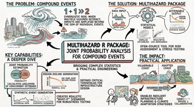

<h1 align="left">Welcome! </h1>
<!--

-->

<!--

-->

> I'm a researcher in the **CoRE Lab** at the **University of Central Florida** specializing in applying statistical methods to coastal flood risk analysis, compound flooding, and other water resource challenges. I have a **Ph.D. in Civil Engineering** from the **University of Plymouth ([UOP](https://www.plymouth.ac.uk/))**, where my research focused on improving the representation of the fragility of coastal structures. 
> 
> 

<!--
> 🌍 During my career I have collaborated with many govermnetal and non- governmental organizations including **HR Wallingford**, **Hazen and Sawyer**, **SFWMD**, **TWI** and **FEMA**.
-->

> I combine hydrology, data science, and computational modeling to solve pressing water challenges facing coastal communities. Whether it's predicting compound flooding, optimizing stormwater infrastructure, or restoring natural coastlines, I'm driven by the opportunity to translate research into actionable solutions that make communities safer and more resilient.

---

<!--

<h1 align="left">Hi there!</h1>

>I am a Water Resources Engineer and a Researcher in Multi-hazards and Compound Climate & Weather Extremes. I’ve recently completed a Ph.D. in Civil Engineering (Major: Water Resources Engineering) in the [Coastal Risks and Engineering (CoRE) Research Lab](https://core-lab.weebly.com/) at the University of Central Florida ([UCF](https://www.ucf.edu/)).
>My doctoral research work focused on multi-hazards risk assessment and analyzing compound climate/weather extreme events and their spatial and temporal interactions and socio-economic impacts using machine learning, statistical, and impact-based methods.

<h3 align="left">:mailbox: How to reach me:</h3>
 

 
  
  
  
  
  
 

 

------------------------------------------------

<h1 align="left">Hi there! </h1>

> I'm **Dr. Javed Ali** – a Water Resources Engineer and Climate Risk Researcher passionate about solving intricate water and environmental challenges. I recently earned my **Ph.D. in Civil Engineering (Water Resources Engineering)** from the **University of Central Florida (UCF)**, specializing in multi-hazard risk assessment and the analysis of compound climate and weather extremes. By integrating hydrologic and hydraulic modeling, geospatial analysis, and advanced data-driven techniques, I develop sustainable solutions that build resilient water systems and communities.
>
> Currently, I work at **WSP USA Inc.**, where I lead technical modeling and analysis efforts, developing advanced solutions in flood risk mitigation, stormwater management, and climate resilience to support informed decision-making and sustainable infrastructure planning.

<h3 align="left">:mailbox: Connect with me:</h3>

  
  
  
  
  
  

 

-----------------------------------------------------

<h1 align="left">Hi there! </h1>

👋 I'm an **Experienced Water Resources Engineer** at WSP USA, holding a **PhD** 🎓 in Civil Engineering (Water Resources) from the University of Central Florida ([UCF](https://www.ucf.edu/)). My doctoral research, conducted within the [Coastal Risks and Engineering (CoRE) Research Lab](https://core-lab.weebly.com/) at UCF's [National Center for Integrated Coastal Research](https://coastal.ucf.edu/), focused on:

* 🌊 Multi-hazard risk assessment.
* 🌪️ Compound climate and weather extreme events.
* 📊 Analyzing spatial/temporal interactions and socio-economic impacts using machine learning, statistical, and impact-based methods.
* 💡 Climate change adaptation and resilience strategies.

I apply advanced skills in **hydrologic, hydrodynamic, and hydraulic modeling** 💧, **geospatial analysis (GIS)** 🗺️, and **data science** 📈 to address complex water resource challenges and enhance community resilience 🏘️.

🔬 **Key Research Projects:**
* 🌐 The Megalopolitan Coastal Transformation Hub (MACH) (NSF)
* 🏠 Building Community Resilience through Residential Risk Disclosure (NAS)
* ⛰️ Geomorphic versus Climatic Drivers of Changing Coastal Flood Risk (NSF)
* ⚡ Clean, Affordable, and Resilient Energy Systems (CARES) (DOE)

---

<h3 align="left">💻 Technical Skills:</h3>

  &emsp;<b>Programming:</b> 
     Python, 
     R, 
     SQL, 
     MATLAB, 
     Markdown, 
     HTML, 
     CSS 
  &emsp;<b>Developer Tools:</b> 
     Git, 
     GitHub, 
     VS Code, 
     Google Colab, 
     Jupyter, 
     Anaconda, 
     RStudio 
  &emsp;<b>Modeling & GIS:</b> DHI MIKE Suite, HEC-RAS, HEC-HMS, MODFLOW, SWMM, ICPR4, NextGen CFE, GeoClaw, ArcGIS Pro, QGIS, WebGIS 
  &emsp;<b>OS:</b>  Windows,  MacOS,  Linux 
  &emsp;<b>Data Science:</b> 🤖 Machine Learning, 📈 Statistical Modeling, 📊 Data Analysis & Visualization

---

<h3 align="left">📫 How to reach me:</h3>

      
  
  

---

 

 

👨‍🔬 I am open to collaborating on any multi-hazards or weather/climate extremes-related research. 

-->
